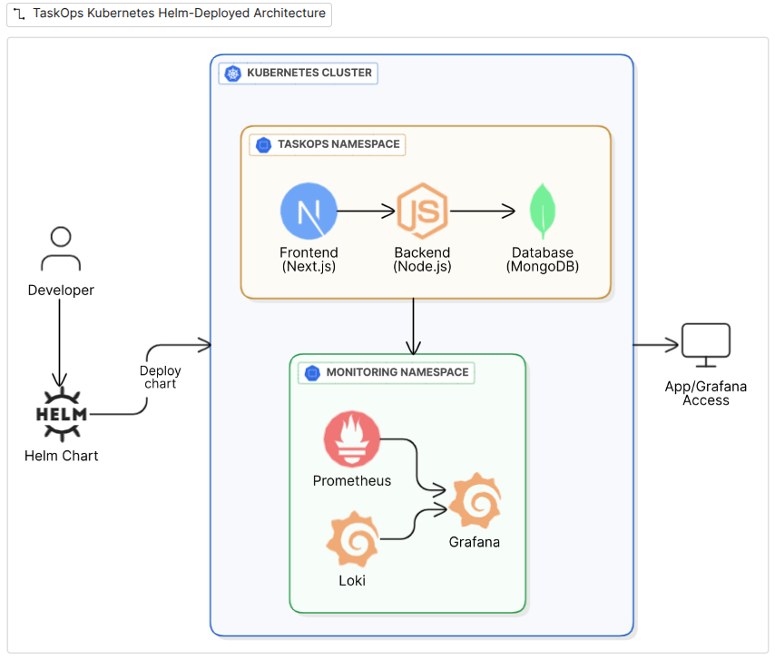

# TaskOps 


---

A microservices-based task management app designed as a personal DevOps playground.
Explore and practice cloud-native technologies including Kubernetes, Helm, CI/CD, observability, and more.

## 🎯 Learning Goals

- Kubernetes fundamentals (pods, deployments, services)
- Helm charts and package management
- CI/CD pipelines with GitHub Actions
- Observability with Prometheus, Grafana, and Loki
- Microservices architecture patterns
- 12-Factor App practices


## Infrastructure

<p align="center">  </p>


## 📁 Project Structure

```
taskOps/
├── app/                    # Docker Compose setup
├── k8/                     # Kubernetes manifests
├── helm/                   # Basic Helm chart
├── helm-with-monitoring/   # Helm + Prometheus + Grafana + Loki
├── services/
│   ├── identity/          # Java Spring Boot service
│   └── identity-ts/       # Node.js TypeScript version
└── .github/workflows/     # CI/CD pipelines
```


## 🚀 Quick Start

### 🐳 Simple Todo App
```bash
cd app/
```
📖 **[See app/README.md](app/README.md)** for detailed setup instructions

### ☸️ Kubernetes Deployment
```bash
cd k8/
```
📖 **[See k8/README.md](k8/README.md)** for Kubernetes deployment guide

### 📊 Full Monitoring Stack
```bash
cd helm-with-monitoring/
```
📖 **[See helm-with-monitoring/README.md](helm-with-monitoring/README.md)** for complete monitoring setup


---

*Built for learning, experimenting, and having fun with DevOps tools! 🎉*