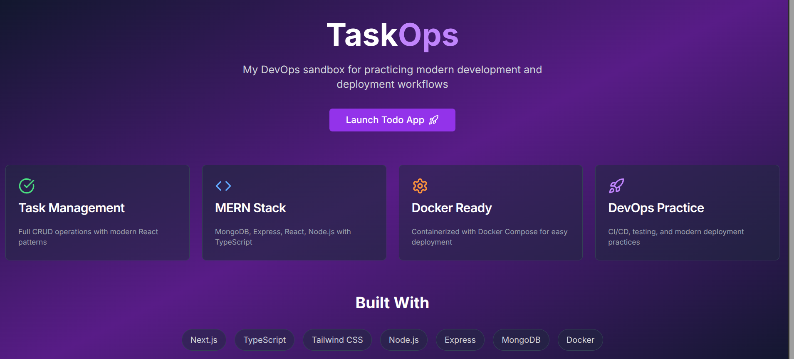
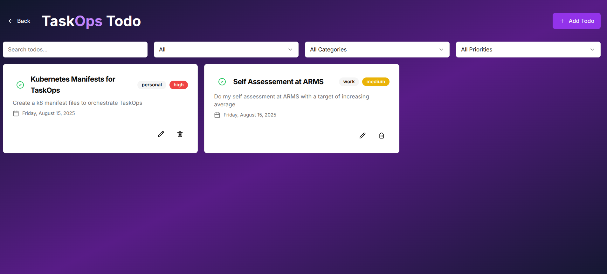

# TaskOps Todo App

Simple task management application with frontend and backend.

## Screenshots
 - Homepage
<p align="center">  </p>

- Task Dashboard
<p align="center">  </p>


## Features
- **Frontend**: React UI
- **Backend**: Node.js API  
- **Database**: MongoDB
- **Docker**: Containerized setup

## Functionalities

- ✅ **Create/Add Tasks** - Add new tasks to your todo list
- ✏️ **Edit Tasks** - Update existing task details
- 🗑️ **Delete Tasks** - Remove completed or unwanted tasks
- 🔍 **Search Tasks** - Find tasks quickly with search functionality

## Quick Start

```bash
docker-compose up -d
```

**Access the app:**
- Frontend: http://localhost:3000
- Backend API: http://localhost:4000
- MongoDB: localhost:27017

## Services

- **Frontend**: React UI (port 3000)
- **Backend**: Node.js API (port 4000) 
- **Database**: MongoDB (port 27017)

## Repository

https://github.com/godcandidate/my_todo_lab

## Stop

```bash
docker-compose down
```