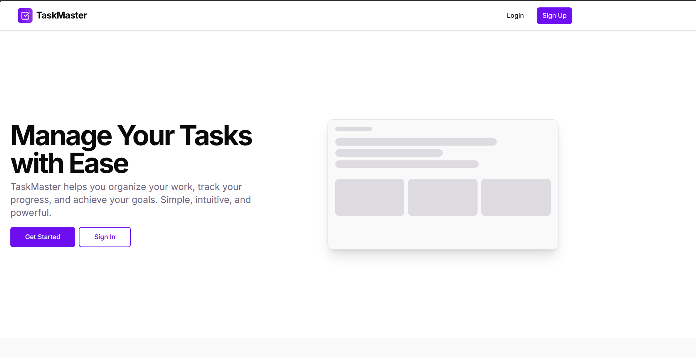
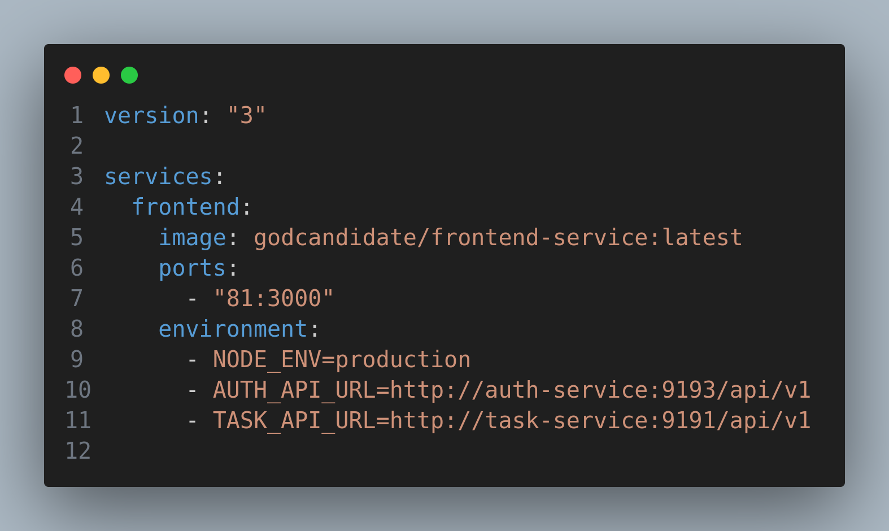

# TaskMaster Frontend


TaskMaster is a modern task management application built with Next.js that provides role-based dashboards for both administrators and regular users. The application features a clean, responsive UI and supports Docker deployment for easy setup.

<p align="center">  </p>

## Features

- **Role-Based Access**

  - Admin dashboard for complete task management
  - User dashboard for viewing and updating assigned tasks

- **Task Management**

  - Create, edit, and delete tasks
  - Assign tasks to users
  - Set priority levels (low, medium, high)
  - Categorize tasks
  - Set due dates
  - Update task status (pending, in-progress, completed)

- **Search & Filter**

  - Filter tasks by title, priority, category, status, and due date
  - Real-time search results

- **User Authentication**
  - Login/register functionality
  - Protected routes
  - User profile management

## Technologies

- Next.js with TypeScript
- Tailwind CSS for styling
- Shadcn UI components
- Docker for containerization
- Runtime configuration for environment variables

## Setup with Docker Compose

<p align="center">  </p>

### Prerequisites

- Docker and Docker Compose installed on your system

### Environment Variables

The application uses the following environment variables that are set in the docker-compose.yaml file:

```yaml
environment:
  - NODE_ENV=production
  - AUTH_API_URL=http://identity-service:9193/api/v1
  - TASK_API_URL=http://task-service:9191/api/v1
  - (the port of your services could be any) 
```

### Running the Application

1. Clone the repository

   ```bash
   git clone <repository-url>
   cd frontend-service
   ```

2. Start the application with Docker Compose

   ```bash
   docker compose up -d
   ```

3. Access the application at http://localhost:81

### Test Credentials

- **Sign up users to test the system**
- **Example Admin User**:

  - Email: admin@example.com
  - Password: admin123

- **Example Regular User**:
  - Email: user@example.com
  - Password: user123

## Runtime Configuration

The application uses a runtime configuration approach that allows environment variables to be set when the Docker container starts, rather than being baked into the JavaScript at build time. This makes the application more flexible and easier to deploy in different environments.
